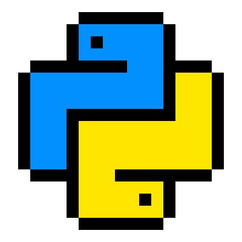
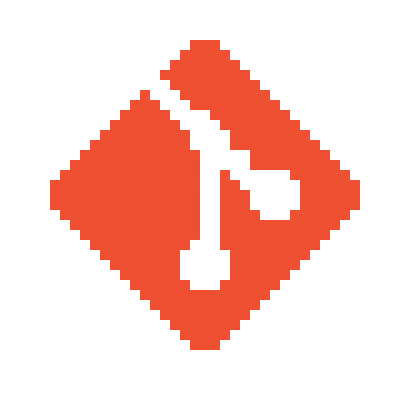

# Gefest

**Backend with a little of Frontend | Django Developer**

Building robust backend systems with Python and Django, while crafting simple frontend interfaces when needed.

---

## 🛠️ Tech Stack
 
 

  
  
  
  
  
  
  

---

## 👥 My Team

### Working Together to Build Amazing Things! 🚀

**Our Strengths:** Python Development • Database Design • API Creation • Clean Frontends

---

## 📊 GitHub Stats

---
