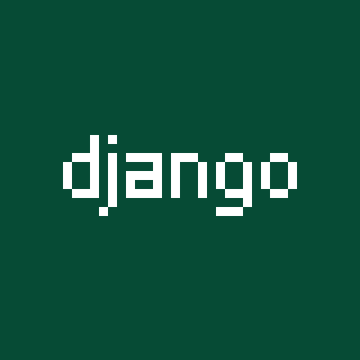

<div align="center">

# 🔥 Gefest

**Backend with a little of Frontend | Python & Django Developer**

Building robust backend systems with Python and Django, while crafting clean frontend interfaces when needed.

[](https://yourportfolio.com)
[](https://linkedin.com/in/yourprofile)
[](mailto:your.email@domain.com)

</div>

---

## 🛠️ Tech Stack

Here are the technologies I work with:

<div align="center">

| Technology | Logo | Use Case |
|------------|------|----------|
| **Python** |  | Backend Development & Scripting |
| **Django** |  | Web Framework & APIs |
| **PostgreSQL** |  | Database Management |
| **HTML** |  | Frontend Structure |
| **CSS** |  | Styling & Layout |
| **JavaScript** |  | Frontend Interactivity |
| **Git** |  | Version Control |

</div>

---

## 💼 My Projects

### 🔧 Backend Focused
- **Django REST API** - Robust backend system with authentication and CRUD operations
- **E-commerce Platform** - Full-featured online store with payment integration
- **Task Management System** - API for project and task tracking

### 🎨 Full Stack
- **Portfolio Website** - Django backend with custom frontend
- **Blog Application** - Content management with admin interface
- **Data Dashboard** - Visualizing data with Django and JavaScript charts

---

## 👥 My Team

<div align="center">


### Working Together to Build Amazing Things! 🚀

This is my incredible team! We collaborate on building robust backend systems and user-friendly interfaces. Our diverse skills in both backend and frontend technologies allow us to deliver complete solutions.

**Our Strengths:** Python Development • Database Design • API Creation • Clean Frontends

</div>

---

## 📊 GitHub Stats

<div align="center">


</div>

---

## 🐍 Python & Django Expertise

```python
# Example of my typical Django view
from django.shortcuts import render
from django.http import JsonResponse
from .models import Project

def project_api_view(request):
    """REST API endpoint for project data"""
    projects = Project.objects.all().values('name', 'description', 'tech_stack')
    return JsonResponse(list(projects), safe=False)